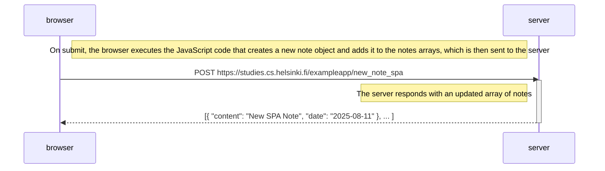

```mermaid
sequenceDiagram
    participant browser
    participant server
    
    Note right of browser: On submit, the browser executes the JavaScript code that creates a new note object and adds it to the notes arrays, which is then sent to the server
    
    browser->>server: POST https://studies.cs.helsinki.fi/exampleapp/new_note_spa
    activate server
    
    Note left of server: The server responds with an updated array of notes   

    
    server-->>browser: [{ "content": "New SPA Note", "date": "2025-08-11" }, ... ]
    deactivate server

```
