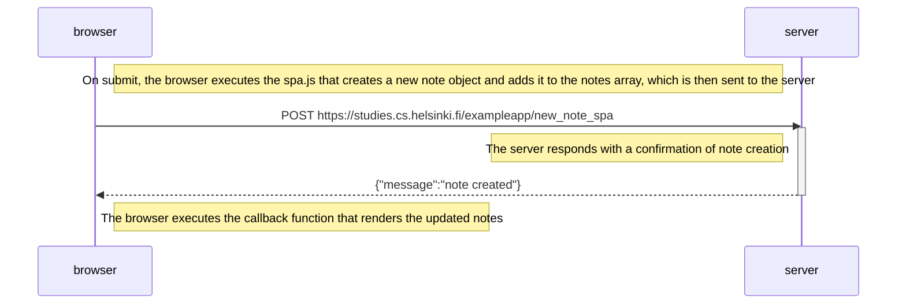

```mermaid
sequenceDiagram
    participant browser
    participant server
    
    Note right of browser: On submit, the browser executes the spa.js that creates a new note object and adds it to the notes array, which is then sent to the server
    
    browser->>server: POST https://studies.cs.helsinki.fi/exampleapp/new_note_spa
    activate server
    
    Note left of server: The server responds with a confirmation of note creation  
 
    server-->>browser: {"message":"note created"}
    deactivate server
    
    Note right of browser: The browser executes the callback function that renders the updated notes

```
